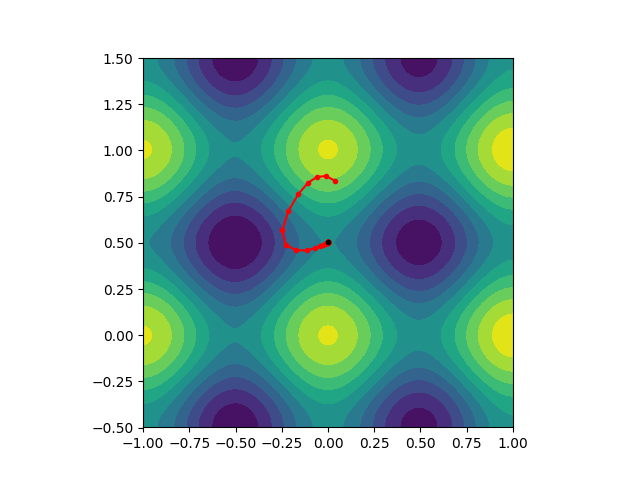

# saddle
A simple python library for finding saddle points of arbitrary stability index

# used libraries
* pytorch

# How to proceed
Simply look into example files:
* ex1_basic.py
* ex2_contour_plot.py

example of algorithm finding saddle point with index k=1 for two-dimensional Rastrigin function
* ex3_benchmark.py

* ex4_gauss_random_parabolic.py

# Help
help is provided under commands
```
help(find_saddle)
help(show_trajectory)
```
# GAD Algorithm
Implemented algorithm is the Gentlest Ascent Dynamics described in [https://link.springer.com/article/10.1007/s00214-018-2246-8] and [https://iopscience.iop.org/article/10.1088/0951-7715/24/6/008/meta].
